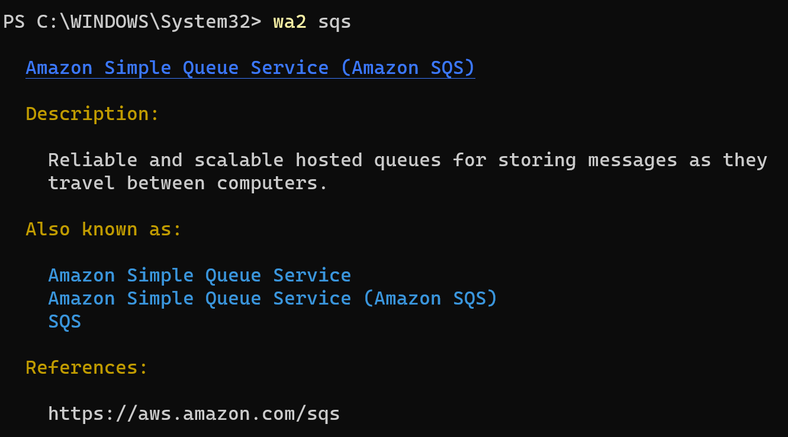
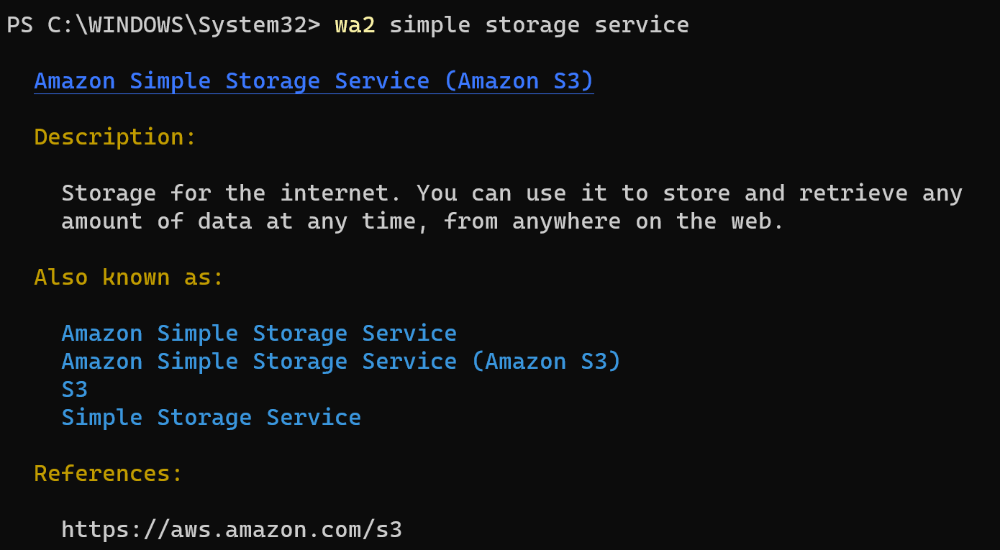
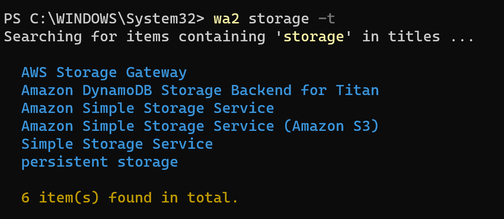
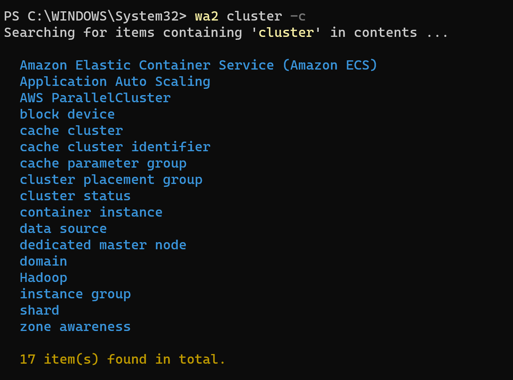
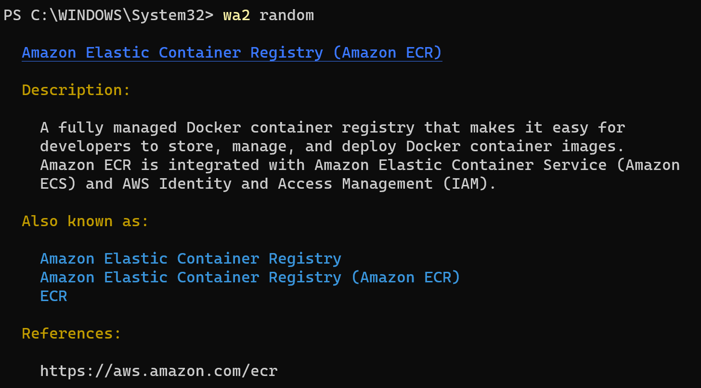
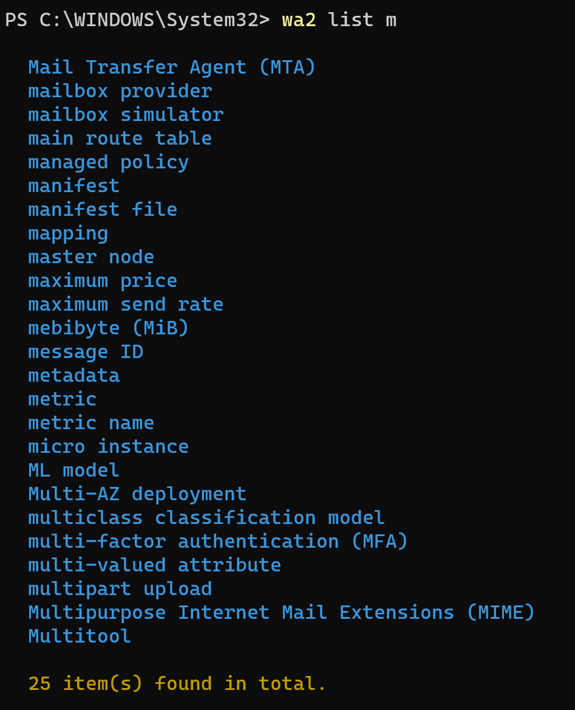

# WA2
**WA2** is short for **'WTF is this AWS Acronym'**. This is a simple AWS terminology look up tool, which can help you learn AWS (or prepare for an AWS exam, for example).

## Installation

```bash
$ npm i wa2 -g
```

## Usage

### Look up

You can look up a service by its abbreviation or by its full name, simply use:

```bash
$ wa2 <the service you want to look up>
```

#### Examples

- By abbreviation:
  
-  By full name:
  


Directly using the ```wa2``` command will only look for the item that exactly matches the queried name. If you are not sure of the exact name, you can use the ```-t``` or ```--title``` flag to query for any items that contain the queried key word(s) in the title; or you can use the ```-c``` or ```--content``` flag to query in the content.

#### Examples

- Query in the title:
  
- Query in the content:
  

Note that the ```-t``` and ```-c``` flags can be combined:


Sometimes during your learning of AWS, you may want to randomly pick up a service to learn about. WA2 provides the ```random``` commend to facilitate this. It randomly shows you an item in the glossary list:



Just like any other glossary list, wa2 can list services by the initial letter:



### Updating

WA2 stores the glossary list in a JSON file. This file is stored locally on your computer when you install WA2 from npm. This glossary was generated from the data on the AWS official glossary page: https://docs.aws.amazon.com/general/latest/gr/glos-chap.html .

In order to keep this glossary list up-to-date, WA2 provides the ```update``` command (**however, you should not need to use this command often**). Running 

```bash
$ wa2 update
```

will generate and use a new glossary list.

The original glossary list is not automatically removed. You can use

```bash
$ wa2 update --revert
```

or

```bash
$ wa2 update -r
```

to revert to the previous version. This is in case that the AWS changes its page structure, and the fetched data are no longer processed properly.

You can also use

```bash
$ wa2 update --list
```

or

```bash
$ wa2 update -l
```

to get all versions of glossaries available, with each glossary list attached with an id number. Then, you can use

```bash
$ wa2 update --revert [id]
```

or

```bash
$ wa2 update -r [id]
```

with [id] being the id of a particular version of glossary, to revert to that version. Or use 

```bash
$ wa2 update --delete <id>
```

or

```bash
$ wa2 update -d <id>
```

to remove that glossary list permanently from your computer.


